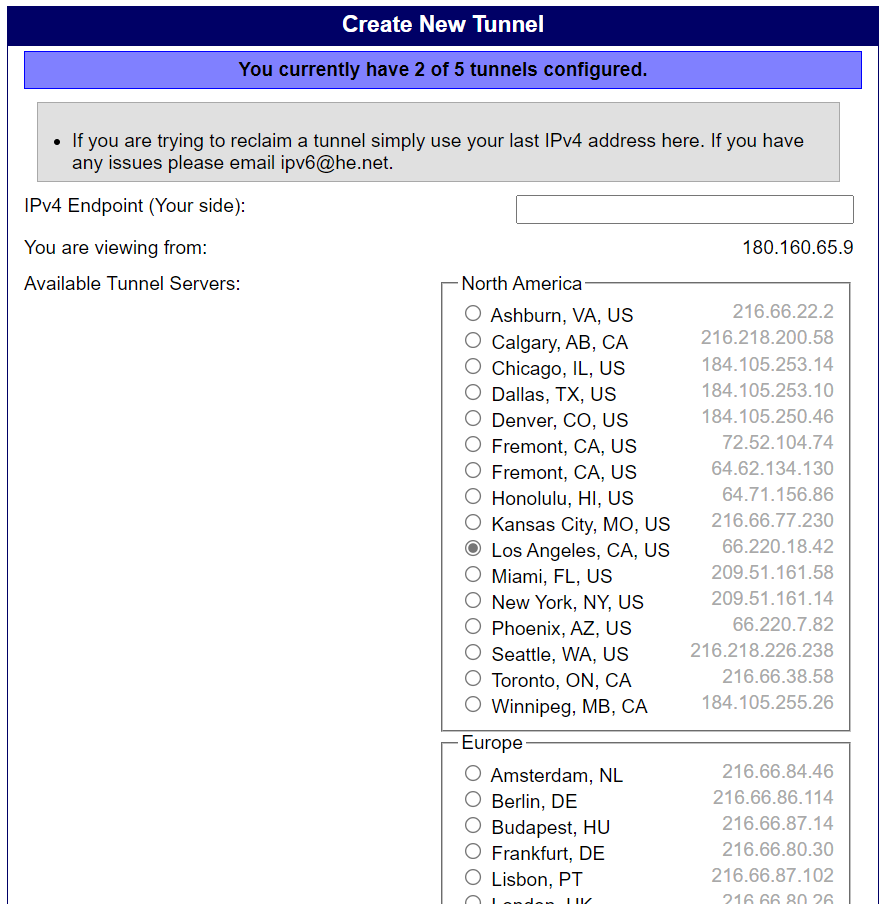
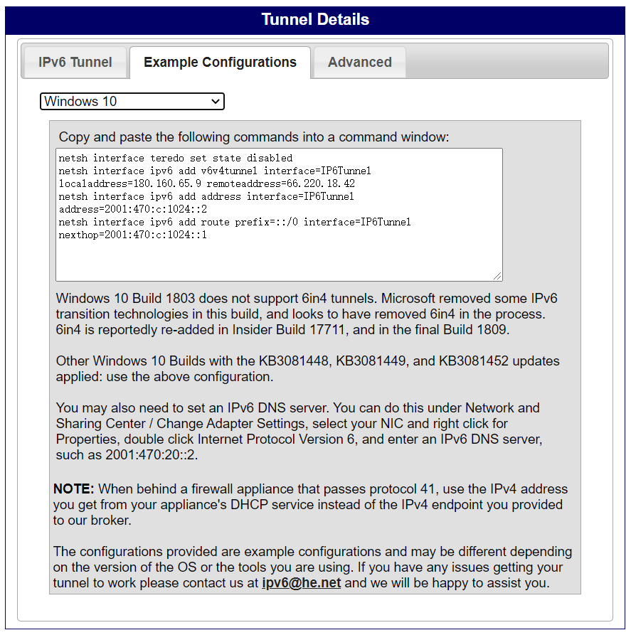

《关于我第一次使用6in4配IPv6搞了两个小时这件事》
=========

~~开学真爽~~

事情是这样的。

上回说到家里移动老贼没给公网IP，于是乎只能用IPv6做穿透。开学之后发现，学校里面貌似没有IPv6（吐槽一句，都1202年了还不给IPv6  orz），所以家里的服务器只能吃灰。

于是打算找个方法整个IPv6。

去年就已经打过电话给运营商了，结果毋需多言了。

然后  就开始捣鼓隧道了......

~~鉴于*Test-ipv6*的作者说他讨厌6to4~~，这次学习了[*Hurricane Electric*](https://tunnelbroker.net/)的使用。


--------


**以下为简单目录**

**[1. 6in4以及简单介绍](#1.1)**

**[2. Hurricane Electric注册和申请](#1.2)**

**[3. 本地配置(**NAT**)](#1.3)**

**[4. 删除](#1.4)**

**[胡言乱语](#1.5)**

----


<h2 id='1.1'> 6in4以及简单介绍</h2>

> **6in4**是一种[IPv6](https://baike.baidu.com/item/IPv6)转换传送机制，是将IPv6的数据包直接封装在[IPv4](https://baike.baidu.com/item/IPv4)数据包中，通过IPv4链路一条明确配置的[隧道](https://baike.baidu.com/item/隧道)中进行传送，相应定义在[RFC](https://baike.baidu.com/item/RFC) 4213中（废除自[RFC](https://baike.baidu.com/item/RFC) 2893和[RFC](https://baike.baidu.com/item/RFC) 1933）。
>
> 当 6in4 穿隧中的一端是在网上地址转换之后，在某些情况下用户能使用[DMZ](https://baike.baidu.com/item/DMZ)。这些网上地址转换路由路会传递所有进入的协议号为41的IPv4包转发到指定DMZ主机上，并使得隧道得以运作。
>
> 有些网上地址转换设备甚至允许 6in4 的转换运算。
>
> *摘自百度百科 [6in4_百度百科 (baidu.com)](https://baike.baidu.com/item/6in4/19265546?fr=aladdin)*

**和6to4的区别**

> 虽然名字相似、封装方法相同，[6to4](https://baike.baidu.com/item/6to4)是将终端的IPv4地址嵌入到其IPv6地址，代替使用手工配置隧道终端信息，从而实现自动传输，而[6over4](https://baike.baidu.com/item/6over4)则将IPv4基础网络视为[数据链路层](https://baike.baidu.com/item/数据链路层)，通过特定的多播地址在IPv4网络进行多播来传输。[ISATAP](https://baike.baidu.com/item/ISATAP)也同样使用相同的协议号和封装方法来封装数据包。
>
> *摘自百度百科 [6in4_百度百科 (baidu.com)](https://baike.baidu.com/item/6in4/19265546?fr=aladdin)*


<h2 id='1.2'> Hurricane Electric注册和申请</h2>

​	**需要注意的是，HE是基于已经有公网IPv4（动态静态皆可）的。如果公网IPv4也没有的话，建议摆烂。**

​	HE的注册很简单,主页左边的登录框下面有*Register*按钮,按照提示填写信息,邮箱验证之后即可直接登录。

登录完成后，点击左下角*User Functions*中的*Create Regular Tunnel*。



​	IPv4 Endpoint(Your side): 既是填写你的公网IP，通常是下面显示的那个。如果红色报错，可能是由于防火墙或者是映射问题，可以尝试设置NAT或者DMZ主机解决。

​	节点一般自动选择的是延迟最低的，如果发现有延迟更低的可以选择其他选项。
​	填写完毕后往下拉，点击Create Tunnel。进入新的页面后点击中间的的*Example Configurations*,在下面的下拉菜单中选择自己使用的系统。（这里以Win10举例。P.S.:其实我用的是Win11，但是无伤大雅）



​	将框内指令复制下来。

```shell
netsh interface teredo set state disabled
netsh interface ipv6 add v6v4tunnel interface=IP6Tunnel localaddress=180.160.65.9 remoteaddress=66.220.18.42
netsh interface ipv6 add address interface=IP6Tunnel address=2001:xxx:xxxx:xxxx::2
netsh interface ipv6 add route prefix=::/0 interface=IP6Tunnel nexthop=2001:xxxx:xxxx:xxxx::1
```

**此处注意！如果你并非直接公网IP接电脑上的（也就是说是通过路由器NAT上网的）**，那么这里需要把第二行中的

`localaddress=xxx.xxx.xxx.xxx`

修改为你的局域网IP地址（通常为192.168.xxx.xxx，可以通过cmd ipconfig查看）

比如我是

```powershell
netsh interface teredo set state disabled
netsh interface ipv6 add v6v4tunnel interface=IP6Tunnel localaddress=192.168.3.32 remoteaddress=66.220.18.42
netsh interface ipv6 add address interface=IP6Tunnel address=2001:xxx:xxxx:xxxx::2
netsh interface ipv6 add route prefix=::/0 interface=IP6Tunnel nexthop=2001:xxxx:xxxx:xxxx::1
```

修改好后用管理员权限打开cmd，依次复制粘贴运行。

<h2 id='1.3'>本地配置（NAT）</h2>

前面已经讲到，可以在路由器中配置DMZ主机或者NAT映射。

本地基本上只需要配置DNS服务器。控制面板->网络和共享中心->更改适配器设置->双击你正在使用的网络链接->属性->Internet 协议版本 6 (TCP/IPv6)->选择使用下面的 DNS 服务器地址 ->填入 `2001:470:20::2` ->确定确定

至此，打开[IPv6Test](https://www.test-ipv6.com/)应该已经可以看到成功了。

但是这个速度和延迟。。。。。。。算了  能用已经不错了。


<h2 id='1.4'>删除</h2>

```shell
netsh interface ipv6 reset
netsh int ipv6 delete interface "IP6Tunnel"
netsh interface teredo set state disable
netsh interface isatap set state disable
```

<h2 id='1.5'>胡言乱语</h2>

 ***我是傻宝***


最近应该还会更一期OpenWrt passwall的食用方法（


 *By JSYRD*
