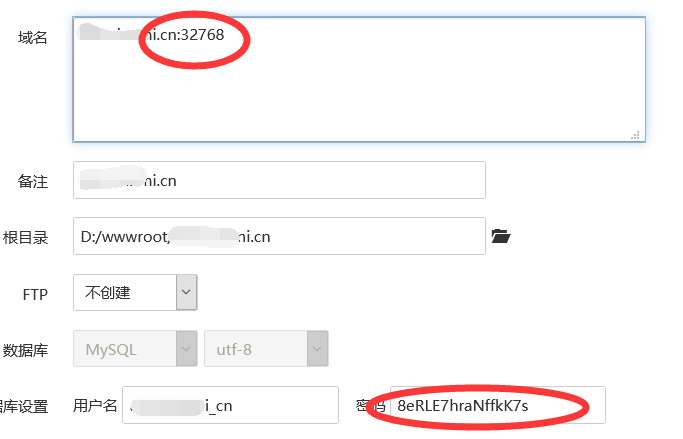

《关于我第一次被迫使用阿里云和被查水表以及使用宝塔面板这件事》
------

先说一下这段时间发生了什么Orz

首先是期中考试周，头疼的一，所以基本都在~~摸鱼~~复习，没有继续搞服务器。~~而且也没钱了~~去了一趟西安爬了一趟华山美滋滋，把琐事都抛掷脑后了。

但偶然的机会我获知有个神秘的技术叫做ddns，瞬间两眼放光（

-----

**以下为简单目录**

**[1. DDNS以及简单介绍](#1.1)**

**[2. 万能的宝塔面板](#1.2)**

**[3. Wordpress 外网访问问题](#1.3)**

**[4. wol](#1.4)**

**[胡言乱语](#1.5)**

----

<h2 id='1.1'>DDNS以及简单介绍</h2>
*DDNS*，全称*Dynamic Domain Name Server*即动态域名服务，通俗的说就是*动态DNS*，一般可以通过软件实现。这里我用到的是github上**开源**的**[ddns-go](https://github.com/szrq/ddns-go)**项目。具体说明在项目。大概原理就是通过阿里云的*AccessKey*(其他的类似)来代理，每隔五分钟获取本地IP地址并解析，实现动态解析的功能。（顺带一提，华为路由器自带ddns功能，但目前只支持花生壳）

有了ddns，我们就可以在外网访问局域网了，但需要有阿里云的域名。

于是乎，第一次开始使用阿里云。然而让我惊喜的是阿里云的二手域名还挺便宜的，就买了两个用，正好之前江狐提供二级域名，结果跑路没得用了，可以换用这个。

*ddns-go*的配置没什么好说的，就有一点是获取IP方式那里，最好**通过接口获取**，然后下面填小字面给的那几个之一，比如 `https://myip.ipip.net` ,这些网址的功能是作为接口，获取你当前的公网IP地址。填完之后拉到最下面save即可。注意，ddns-go这个软件是要一直运行的，关闭之后就停止运行了，效果最多维持到你的IP下一次刷新之前。

然后可以把ddns-go设置开机启动，可以通过计划任务，也可以直接<kbd>WIN</kbd>+<kbd>R</kbd>,打开*shell:startup*，然后把*ddns-go*创建一个快捷方式放里面就行。但要注意的是ddns-go并不需要管理员权限，如果是需要管理员权限的需要通过计划任务自启，网上教程很多。

接下来是面板。直接用原生的iis文件管理也不是不行，但是~~b格不够~~使用起来不方便，而且安全问题很大。所以一番搜索之后决定使用宝塔面板部署可道云。(FBI WARNING:个人提供下载服务是不合法的，本次实验仅为个人学习使用，如需个人搭建请遵守相关法律规定)

<h2 id='1.2'>万能的宝塔面板</h2>

宝塔面板是一款服务器管理软件，支持windows和linux，但在windows server或linux上运行要比windows上好一些。

借用B乎网友的话评价宝塔面板就是，牛B的不像个样，这玩意儿功能太多了，可以一键部署上百个网站，支持nginx,iis,apache。里面还有各种插件等，功能十足。我们这里使用的是iis(因为nginx的配置学不来)。

进入宝塔面板之后，在下面的软件管理-宝塔插件里可以看到宝塔一键部署源码，安装之后刷新页面，点击设置进去可以看到很多可以一键部署的网站。选择好要部署的网站之后点击部署，会弹出设置页面。这里需要注意的是域名如果是其它端口（例如32768），则需要输入带域名的网址(例如 abc.example.com:32768)

另外这里的数据库密码建议改一个好记的。

部署好之后，我们需要在iis里稍微调整亿下，因为我们使用的并不是标准端口。
打开iis，把左边的目录树展开，找到刚部署的网页，**点击绑定，这里要先把主机名去掉，然后IP地址选择本机ip地址，端口不用动。**

设置好以后点击重新启动网页，在本地浏览器中输入你刚才的ip:xxxxx(例如192.168.3.33:32767)，回车进入页面。*（这里可能出现一些其它的问题，例如iis配置文件丢失等等，把错误代码在百度上搜一下都可以找到答案，这里不再赘述。）*有些页面可能需要设置数据库，管理员信息等等（如Wordpress,discuz等，按照提示输入正确的信息即可。这里的数据库名和数据库密码在宝塔页面中可以查询到。

完全设置好之后，我们就可以回到iis，把主机名改回来（改成你的域名），然后保存重新启动。然而此时并不能在公网访问，原因是路由器并不知道请求要转发到哪台机器上，所以我们需要进入路由器设置页面（如192.168.3.1)，先选择局域网设置，给你的主机绑定一个静态ip地址（可以直接绑定现在路由器自动分配的那个地址），然后选择NAT网关，添加端口映射，映射到你的主机即可。此时应该是能从公网成功访问了，我也是测了一下速度，然而。。。。。

上传速度还行，最快40Mbps，然而下载速度最高512KB/S。。。。

这就很离谱了亲人们，我这又不是百度网盘，没有设置限速啊，但是速度依然很慢。于是想到会不会是路由器限速了？实际测试后发现在内网能跑满1Gbps。又想到会不会是主机限速了？即使按照网上教程将缓冲区设置得更小也无济于事，最后想起来可能是带宽的问题，果不其然，speedtest跑了个速度    上传带宽仅有5Mbps=512KB/s    只能说这波电信大胜利。

***注意了亲人们，国家工信部早在2019年就出台了下行带宽与上行带宽的最低比，100Mbps一下下行带宽，上行与下行比例不能低于1:5，也就是说我们宿舍100Mbps的下行带宽应该有至少20Mbps的上传带宽，但是经过我与电信三天的拉扯，最后以我们是老套餐（今年刚办的套餐）不能升级作罢。（再吐槽一句，校园宽带还真就内个法外之地）***

无奈之下，只能另想出路。被迫花w买了阿里云的外挂cdn 100G流量。正当我以为解决问题的时候，我被查水表了，原因是cdn会自动检测使用的域名有没有备案。 

备案？我还没成年啊orz

于是阿里云含泪白嫖我20rmb。（

算了，就这样吧。反正也不缺云盘（

<h2 id='1.3'>外网Wordpress访问问题</h2>

退一步越想越气，整了台服务器结果跑不了云盘，那不如跑一些带宽要求不高的页面。正好有Gay友需要帮忙做一个页面，就选择了Wordpress做模板。然而不知为何，配置好相关设置后，总是打不开页面。最后发现是数据库的问题。由于在设置Wordpress安装的时候数据库地址默认使用了localhost，所以在公网无法访问主机数据库，导致一直打不开页面，但是wordpress又不能直接修改数据库地址，只能选择直接改数据库。 

在宝塔面板中安装phpMyAdmin，管理数据库，找到安装wordpress的数据库。找到表wp_options，修改表中的siteurl和home为你的域名，保存。问题解决。

此外，wordrpess还有很多其它的优化方案，比如下载好css文件等等。这里不再赘述。

<h2 id='1.4'>wol</h2>

配置好主机之后，稍微算了算电费，发现emmmm，长时间开着确实不太现实，电费比百度云会员贵得多。于是想有没有可能在需要用的时候开机，不用的时候就关机呢。首先不用的时候关机很好实现，在主机上安装VNC Server，做一个简单的端口映射，VNC Viewer用域名就可以直接访问到主机了。但是需要用的时候开机如何解决？下面介绍WOL

**WOL，全程 Wake On Lan，顾名思义从Lan口启动。**在计算机关闭（S4或S5）状态下，板载网卡或是PCIe网卡还是可以接受幻数据包的，一旦识别到特定的数据包就执行开机操作。一般近年的机器都支持WOL，需要在BIOS中设置。注意，有的设置是分开的，并不全在boot页面，可能在北桥南桥设置等等等等，反正看着像的能打开的都打开）））

然后还需要更新下网卡驱动，然后在网卡设置里将网络唤醒，幻数据包接受什么的都打开，在高级里把允许该设备唤醒计算机勾选，下面那个勾不勾无所谓。然后就可以在路由器页面通过路由器自带软件实现网络唤醒了。但是使用其它软件不行，试验了一个晚上之后得出结论：路由器在设备关机情况下不会进行端口映射操作，导致关机之后数据包无法转发到主机上。有两种解决方案，一种是刷个别的系统进去，例如openwrt之类的，但是保修会失效。另一种是  有的路由器是可以黑进后台的，但是不幸，华为路由器保护的很好Orz。至此只能作罢。

<h2 id='1.5'>胡言乱语</h2>

喜报，我期中考试挂了！
另外   千万别犯病  千万别犯病   千万别犯病。

*By JSYRD*